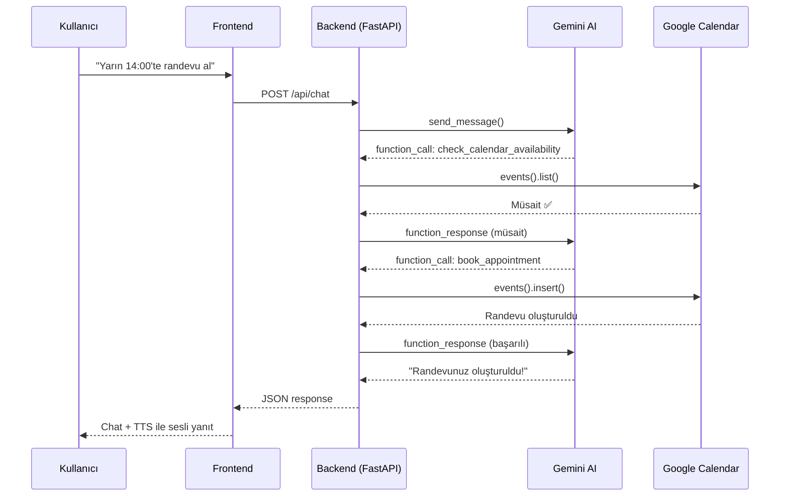

<](https://python.org)
[](https://fastapi.tiangolo.com)
[](https://ai.google.dev)
[](https://developers.google.com/calendar)
[](LICENSE)

<br/>

**Doğal dil ile konuşarak randevu alın, iptal edin ve takviminizi yönetin.**

Gerçek zamanlı sesli iletişim • Google Calendar entegrasyonu • Akıllı müsaitlik kontrolü

<br/>


</div>

---

## 📋 İçindekiler

- [Proje Hakkında](#-proje-hakkında)
- [Özellikler](#-özellikler)
- [Mimari](#-mimari)
- [Teknoloji Stack](#-teknoloji-stack)
- [Kurulum](#-kurulum)
- [Yapılandırma](#-yapılandırma)
- [Kullanım](#-kullanım)
- [API Endpoints](#-api-endpoints)
- [Proje Yapısı](#-proje-yapısı)
- [Ekran Görüntüleri](#-ekran-görüntüleri)
- [Katkıda Bulunma](#-katkıda-bulunma)
- [Lisans](#-lisans)

---

## 🧠 Proje Hakkında

**AI Çağrı Merkezi Asistanı**, Google Gemini 2.5 Flash AI modeli üzerine inşa edilmiş, sesli ve yazılı iletişim ile çalışan akıllı bir randevu yönetim sistemidir. Kullanıcılar doğal Türkçe konuşarak veya yazarak:

- 📅 **Randevu oluşturabilir** — "Yarın saat 14:00'te kayıt olmak istiyorum"
- 🕐 **Müsaitlik sorgulayabilir** — "Cuma günü boş saatleri göster"  
- ❌ **Randevu iptal edebilir** — "Saat 16:00'daki randevumu iptal et"
- 🎨 **Görsel prompt üretebilir** — "Karda koşan atlar için bir prompt hazırla"

Sistem, **Google Calendar API** ile gerçek zamanlı senkronize çalışır — oluşturulan randevular doğrudan Google Takvim'e eklenir.

---

## ✨ Özellikler

### Çekirdek Özellikler

| Özellik | Açıklama |
|---|---|
| 🎙️ **Sesli Asistan** | Web Speech API ile Türkçe ses tanıma (STT) |
| 🔊 **Sesli Yanıt** | Google Cloud WaveNet TTS ile doğal Türkçe sesli yanıt |
| 🤖 **Gemini AI** | Google Gemini 2.5 Flash ile doğal dil anlama ve function calling |
| 📅 **Takvim Entegrasyonu** | Google Calendar API ile gerçek zamanlı randevu yönetimi |
| ✅ **Müsaitlik Kontrolü** | Otomatik çakışma tespiti ve alternatif saat önerileri |
| 🎨 **Prompt Enhancer** | Hunyuan 7B modeli ile görsel prompt zenginleştirme (opsiyonel) |

### Arayüz Özellikleri

| Özellik | Açıklama |
|---|---|
| 🌙 **Karanlık Tema** | Premium dark UI, glassmorphism efektleri |
| ✨ **Particle Animasyonu** | Canlı arka plan parçacık animasyonu |
| 🌈 **Ambient Glow** | Yüzen ışık küreleri ile atmosferik arka plan |
| 📱 **Responsive** | Masaüstü & mobil uyumlu, sidebar navigasyon |
| 💬 **Sohbet Paneli** | Modern chat bubble arayüzü, hızlı eylem butonları |
| 📋 **Takvim Paneli** | Yaklaşan randevuları görüntüleme ve doğrudan Google Calendar bağlantısı |

---

## 🏗️ Mimari

```
┌────────────────────────────────────────────────────────────┐
│                        FRONTEND                             │
│  ┌──────────────┐  ┌──────────────┐  ┌──────────────────┐  │
│  │  Web Speech   │  │  Chat UI &   │  │  Calendar Panel  │  │
│  │  API (STT)    │  │  Quick Actions│  │  (Randevu Liste) │  │
│  └──────┬───────┘  └──────┬───────┘  └────────┬─────────┘  │
│         │                 │                    │             │
│  ┌──────┴─────────────────┴────────────────────┘             │
│  │              HTTP REST API                                │
│  └──────────────────────┬────────────────────────────────┘   │
└─────────────────────────┼────────────────────────────────────┘
                          │
┌─────────────────────────┼────────────────────────────────────┐
│                     BACKEND (FastAPI)                         │
│  ┌──────────────────────┴────────────────────────────────┐   │
│  │                    main.py                              │   │
│  │           /api/chat  •  /api/appointments               │   │
│  └────────┬──────────────────────┬────────────────────────┘   │
│           │                      │                            │
│  ┌────────┴─────────┐  ┌────────┴──────────┐                 │
│  │  gemini_service   │  │  calendar_service  │                │
│  │  ─────────────    │  │  ────────────────  │                │
│  │  • Gemini 2.5     │  │  • check_avail.   │                │
│  │  • Function Call  │  │  • get_slots      │                │
│  │  • Chat Session   │  │  • book_appt      │                │
│  └────────┬─────────┘  │  • cancel_appt     │                │
│           │             └────────┬──────────┘                 │
│  ┌────────┴──────────┐           │                            │
│  │ prompt_enhancer    │  ┌───────┴───────────┐               │
│  │ (Hunyuan 7B, opt.) │  │ Google Calendar   │               │
│  └───────────────────┘  │ API (OAuth 2.0)   │               │
│                          └───────────────────┘               │
└──────────────────────────────────────────────────────────────┘
```

### AI Function Calling Akışı



---

## 🛠️ Teknoloji Stack

### Backend
| Teknoloji | Versiyon | Kullanım |
|---|---|---|
| **Python** | 3.10+ | Ana programlama dili |
| **FastAPI** | 0.115.0 | REST API framework |
| **Uvicorn** | 0.30.6 | ASGI sunucu |
| **Google Generative AI** | 0.8.5 | Gemini 2.5 Flash SDK |
| **Google Calendar API** | v3 | Takvim CRUD işlemleri |
| **Transformers** | latest | Hunyuan prompt enhancer (opsiyonel) |
| **PyTorch** | latest | AI model çalıştırma (opsiyonel) |

### Frontend
| Teknoloji | Kullanım |
|---|---|
| **HTML5 / CSS3 / JS** | Saf web teknolojileri (framework yok) |
| **Web Speech API** | Tarayıcı tabanlı ses tanıma (STT) |
| **Google Cloud TTS** | WaveNet sesli yanıt sentezi |
| **Canvas API** | Particle animasyonları |
| **Inter + JetBrains Mono** | Google Fonts tipografi |

---

## 🚀 Kurulum

### Ön Gereksinimler

- **Python 3.10+** yüklü olmalı
- **Google Cloud Console** hesabı (Calendar API + TTS API)
- **Gemini API Key** ([Google AI Studio](https://aistudio.google.com/apikey))
- **Google Chrome** (Web Speech API desteği için önerilir)

### 1. Repoyu Klonlayın

```bash
git clone https://github.com/KULLANICI_ADINIZ/ai-call-center-assistant.git
cd ai-call-center-assistant
```

### 2. Sanal Ortam Oluşturun

```bash
cd backend
python -m venv venv

# Windows
venv\Scripts\activate

# macOS/Linux
source venv/bin/activate
```

### 3. Bağımlılıkları Yükleyin

```bash
pip install -r requirements.txt
```

> **Not:** Prompt Enhancer (Hunyuan 7B) opsiyoneldir. Sadece temel özellikleri kullanmak istiyorsanız `transformers`, `torch`, `accelerate`, `bitsandbytes` satırlarını `requirements.txt`'den kaldırabilirsiniz.

### 4. Ortam Değişkenlerini Yapılandırın

```bash
# backend/.env dosyası oluşturun
echo "GEMINI_API_KEY=your_gemini_api_key_here" > .env
```

### 5. Google Calendar API Kurulumu

1. [Google Cloud Console](https://console.cloud.google.com)'a gidin
2. Yeni proje oluşturun veya mevcut projeyi seçin
3. **APIs & Services > Library** → "Google Calendar API" arayıp etkinleştirin
4. **APIs & Services > Credentials** → OAuth 2.0 Client ID oluşturun
   - Application type: **Desktop App**
5. JSON dosyasını indirip `backend/credentials.json` olarak kaydedin

### 6. Sunucuyu Başlatın

```bash
python main.py
```

İlk çalıştırmada Google OAuth ekranı açılacak — Google hesabınızla giriş yapıp takvim izni verin. Token otomatik olarak `token.json`'a kaydedilir.

### 7. Tarayıcıda Açın

```
http://localhost:8000
```

---

## ⚙️ Yapılandırma

### Ortam Değişkenleri (`backend/.env`)

| Değişken | Açıklama | Zorunlu |
|---|---|---|
| `GEMINI_API_KEY` | Google Gemini API anahtarı | ✅ Evet |

### Google API Dosyaları (`backend/`)

| Dosya | Açıklama |
|---|---|
| `credentials.json` | Google OAuth 2.0 istemci kimlik bilgileri |
| `token.json` | Otomatik oluşturulan OAuth token (ilk çalıştırmada) |

### Prompt Enhancer (Opsiyonel)

Hunyuan 7B modelini kullanmak için:

```bash
pip install huggingface_hub
python download_model.py
```

> ⚠️ Model ~14GB disk alanı gerektirir. 4-bit quantization ile **8GB RAM + RTX 3050** düzeyinde donanımda çalışabilir.

---

## 📖 Kullanım

### Sesli Kullanım

1. 🎙️ **Mikrofon butonuna basın** — Sistem dinlemeye başlar
2. 🗣️ **Türkçe konuşun** — "Yarın saat 15:00'te randevu almak istiyorum"
3. ⏳ **AI düşünür** — Takvimi kontrol eder, müsaitlik durumuna göre aksiyon alır
4. 🔊 **Sesli yanıt alırsınız** — WaveNet TTS ile doğal Türkçe yanıt

### Yazılı Kullanım

1. 💬 **Metin kutusuna yazın** — Mesajınızı girin
2. ⏎ **Enter'a basın veya gönder butonuna tıklayın**
3. 🤖 **AI yanıtlar** — Chat bubble'da görüntülenir

### Hızlı Eylemler

Karşılama ekranındaki butonlarla hızlıca:
- 📅 **Müsait Saatler** — Yarının boş saatlerini listeler
- 🕐 **Randevu Al** — Doğrudan randevu alma akışını başlatır
- ❌ **Randevu İptal** — Mevcut randevu iptal sürecini başlatır

### Takvim Paneli

Sol menüdeki **Takvim** butonuyla:
- Yaklaşan 30 gün içindeki randevularınızı görüntüleyin
- Her randevunun tarih, saat ve detaylarını inceleyin
- **Google Calendar'da Aç** bağlantısıyla takvime gidin

---

## 🔌 API Endpoints

### `POST /api/chat`

AI asistanına mesaj gönderir.

**Request:**
```json
{
  "message": "Yarın müsait saatleri göster"
}
```

**Response:**
```json
{
  "response": "Yarın için müsait saatler: 09:00, 10:00, 11:00, 13:00, 15:00..."
}
```

### `GET /api/appointments`

Google Calendar'dan yaklaşan randevuları çeker.

**Response:**
```json
{
  "appointments": [
    {
      "id": "abc123",
      "title": "Kayıt Randevusu",
      "description": "AI Randevu Asistanı tarafindan olusturuldu.",
      "start": "2026-04-10T14:00:00+03:00",
      "end": "2026-04-10T15:00:00+03:00",
      "status": "confirmed",
      "link": "https://www.google.com/calendar/event?eid=..."
    }
  ]
}
```

### `GET /` , `GET /app.js` , `GET /style.css`

Frontend statik dosyalarını sunar.

---

## 📂 Proje Yapısı

```
ai-call-center-assistant/
│
├── backend/
│   ├── main.py                    # FastAPI uygulaması & endpoint'ler
│   ├── gemini_service.py          # Gemini AI entegrasyonu & function calling
│   ├── calendar_service.py        # Google Calendar API işlemleri
│   ├── prompt_enhancer_service.py # Hunyuan 7B prompt zenginleştirici
│   ├── download_model.py          # Hunyuan model indirme scripti
│   ├── requirements.txt           # Python bağımlılıkları
│   ├── .env                       # Ortam değişkenleri (gitignore'da)
│   ├── credentials.json           # Google OAuth kimlik bilgileri (gitignore'da)
│   ├── token.json                 # OAuth token (gitignore'da)
│   └── models/                    # AI modelleri dizini (gitignore'da)
│
├── frontend/
│   ├── index.html                 # Ana HTML sayfası
│   ├── app.js                     # Frontend mantığı (STT, TTS, API, UI)
│   └── style.css                  # Ultra-modern dark theme stilleri
│
├── .gitignore
└── README.md
```

---

## 🔒 Güvenlik Notları

> [!CAUTION]
> Aşağıdaki dosyalar **hassas bilgi** içerir ve Git'e eklenmemelidir:

| Dosya | İçerik |
|---|---|
| `backend/.env` | Gemini API anahtarı |
| `backend/credentials.json` | Google OAuth istemci kimlik bilgileri |
| `backend/token.json` | Google OAuth erişim token'ı |

Bu dosyalar `.gitignore` tarafından otomatik olarak hariç tutulmaktadır.

> [!WARNING]
> Frontend `app.js` dosyasında **Google TTS API anahtarı** client-side olarak kullanılmaktadır. Production ortamında bu anahtarı backend üzerinden proxy'lemeniz önerilir.

---

## 🤝 Katkıda Bulunma

1. Bu repoyu **fork** edin
2. Yeni bir **branch** oluşturun (`git checkout -b feature/yeni-ozellik`)
3. Değişikliklerinizi **commit** edin (`git commit -m 'feat: yeni özellik eklendi'`)
4. Branch'i **push** edin (`git push origin feature/yeni-ozellik`)
5. Bir **Pull Request** açın

---

## 📄 Lisans

Bu proje [MIT Lisansı](LICENSE) ile lisanslanmıştır.

---

<div align="center">

**Yapılırken kullanılan teknolojiler**

Google Gemini 2.5 Flash · FastAPI · Google Calendar API · Web Speech API · Google Cloud TTS

<br/>

⭐ Bu projeyi beğendiyseniz yıldız bırakmayı unutmayın!

</div>
]]>
